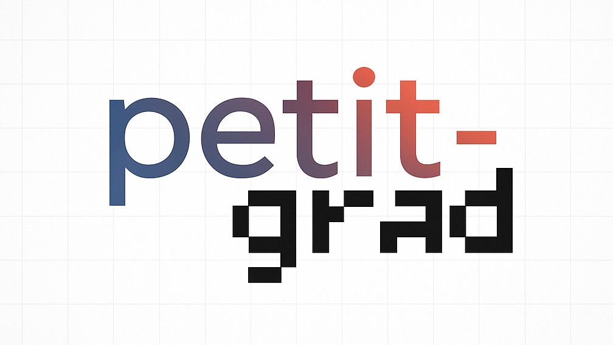
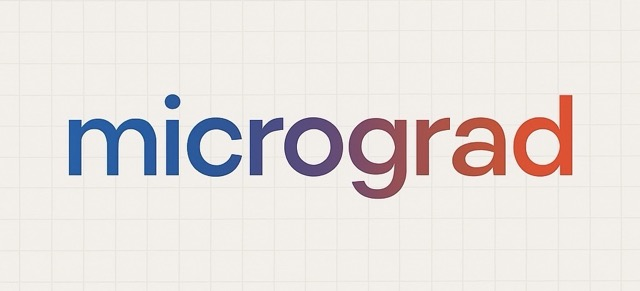

# Micro-Grad: A Learning Journey into Deep Learning Frameworks

<!--  -->

<p align="center">
  
</p>

[](https://opensource.org/licenses/MIT)
[](https://www.python.org/downloads/)
[](https://github.com/sakshambedi/Micro-Grad)

This project is a personal exploration and implementation of a simplified tensor library, inspired by [tinygrad](https://github.com/geohot/tinygrad) and [PyTorch](https://pytorch.org/). The primary goal is to understand the fundamental concepts and mechanics behind modern deep learning frameworks by building one from scratch.

## What is this?

**Micro-Grad** is a Python-based library that provides a `Tensor` object, similar to those found in NumPy, PyTorch, or TensorFlow. It aims to replicate some of the core functionalities, particularly focusing on automatic differentiation and tensor operations, to gain a deeper insight into their inner workings.

This is an educational project. While the aim is to create functional components, it's not intended to be a production-ready deep learning library.

## Current Features

As of now, `Micro-Grad` supports:

### Tensor Creation

- **Creating tensors from various sources:**
  - Python lists or tuples: `Tensor([1, 2, 3])`
  - Single values (scalars): `Tensor(5)` or `Tensor(3.14)`
  - Empty tensors: `Tensor(None)` (creates a scalar tensor with value 0)
- **Data type support:**
  - Specifying `dtype` using the `dtypes` class (defaults to `dtypes.float32`)
  - Supported dtypes: `float32`, `float16`, `int32`, `int8`, `bool`
  - Proper handling for platforms without native `float16` support
- **Factory methods:**
  - `Tensor.ones((2, 3))` - Create tensors filled with ones
  - `Tensor.zeros((2, 3))` - Create tensors filled with zeros
- **Automatic shape inference from nested structures**

### Mathematical Operations

- **Basic arithmetic:**
  - Addition (`+`)
  - Multiplication (`*`)
  - Subtraction (`-`)
  - True Division (`/`)
  - Floor Division (`//`)
- **Operator overloading:**
  - These operations can be used directly with Python's arithmetic operators
  - Reverse operations (`__rmul__`, `__rtruediv__`, etc.) for using tensors with regular Python values
- **Broadcasting:**
  - Scalar to tensor broadcasting
  - Operations between tensors and Python scalars or lists

### Data Access and Manipulation

- **Indexing:**
  - Accessing elements using standard indexing: `tensor[0]` for 1D tensors
  - Multi-dimensional indexing: `tensor[0, 1]` for 2D tensors
- **Conversion:**
  - `to_numpy()` method for NumPy array conversion
  - String representation via `__repr__` and `__str__` methods

### Internal Representation

- **Efficient memory management:**
  - Tensors store data internally using Python's `memoryview` backed by `array.array`
  - Special handling for data types like `float16` when not natively supported
  - Efficient conversion between storage format and Python types

### Edge Cases

- **Division by Zero:**
  - True Division (`/`): Follows NumPy's behavior, resulting in `inf` or `nan`
  - Floor Division (`//`): Raises a `ZeroDivisionError` when division by zero is attempted
- **Zero-Size Tensor Handling:**
  - Operations involving tensors with zero-sized dimensions follow NumPy's behavior

### Automatic Differentiation (Foundation)

- **`requires_grad` attribute for tracking operations**
- **`grad` attribute for storing gradients**
- **Basic propagation of gradient requirements through operations**

## Test Results

Here are the results from running `pytest` in the project root:

```
==================== test session starts =====================
platform darwin -- Python 3.11.3, pytest-8.3.5, pluggy-1.5.0
rootdir: /Users/sakshambedi/Documents/project/ML/tinygrad-homemade
plugins: hypothesis-6.131.15
collected 50 items

tests/binary_ops_test.py ............................  [ 56%]
tests/tensor_test.py ......................            [100%]

===================== 50 passed in 0.28s =====================
```

## Project Structure

```
tinygrad-homemade/
├── grad/
│   ├── tensor.py         # Core tensor implementation
│   ├── dtype.py          # Data type definitions and utilities
│   └── utils/
│       └── fp16.py       # Utilities for float16 handling
├── tests/
│   ├── binary_ops_test.py # Tests for binary operations
│   └── tensor_test.py     # Basic tensor functionality tests
└── README.md             # Project documentation
```

## How to Use / Explore

1. **Clone the repository:**

   ```bash
   git clone https://github.com/sakshambedi/Micro-Grad.git
   cd Micro-Grad
   ```

2. **Explore the code:**

   - Check out `grad/tensor.py` to see the `Tensor` implementation.
   - Run the tests using `pytest` in the root directory to see the operations in action:

     ```bash
     pytest
     ```

3. **Experiment:**
   You can open a Python interpreter in the project's root directory and play with the `Tensor` class:

   ```python
   from grad.tensor import Tensor
   from grad.dtype import dtypes

   # Basic Tensor Creation and Operation
   a = Tensor([1, 2, 3], dtype=dtypes.int32)
   b = Tensor([4, 5, 6], dtype=dtypes.int32)
   c = a + b
   print(c)  # [5, 7, 9]

   # Broadcasting with scalars
   d = Tensor([[1, 2], [3, 4]], dtype=dtypes.float32)
   e = d * 10
   print(e)  # [[10.0, 20.0], [30.0, 40.0]]

   # Indexing
   print(d[0, 1])  # 2.0

   # Converting to NumPy
   numpy_array = d.to_numpy()
   print(type(numpy_array))  # <class 'numpy.ndarray'>

   # Using factory methods
   ones = Tensor.ones((2, 3), dtype=dtypes.float16)
   zeros = Tensor.zeros((2, 2))
   print(ones)  # [[1.0, 1.0, 1.0], [1.0, 1.0, 1.0]]
   print(zeros)  # [[0.0, 0.0], [0.0, 0.0]]
   ```

## Future Plans

### Short-term Goals

- **More Operations:**
  - Matrix multiplication
  - Reshaping and transposing
  - Reduction operations (sum, mean, max)
  - Element-wise operations (pow, exp, log)
- **Advanced Broadcasting:**
  - Full broadcasting support for tensors of different shapes

### Medium-term Goals

- **Automatic Differentiation Engine:**
  - Implement `_backward()` methods for operations
  - Build a simple computational graph
  - Implement the chain rule for gradient calculation
- **Neural Network Components:**
  - Activation functions (ReLU, Sigmoid, Tanh)
  - Basic optimizers (SGD)

### Long-term Goals

- **Simple Neural Network Layers:**
  - Linear layers
  - Basic convolutional operations
- **Device Support:**
  - GPU computation (very future work!)

## Contributing

Since this is primarily a learning project, direct contributions might not be the focus. However, if you're also on a similar learning path, feel free to:

- Fork the repository and experiment with your own implementations
- Suggest improvements or point out areas for learning via Issues
- Share resources or insights that could be helpful

## License

This project is available under the MIT License.

---

This project is a testament to the idea that the best way to understand complex systems is often to build them yourself!
